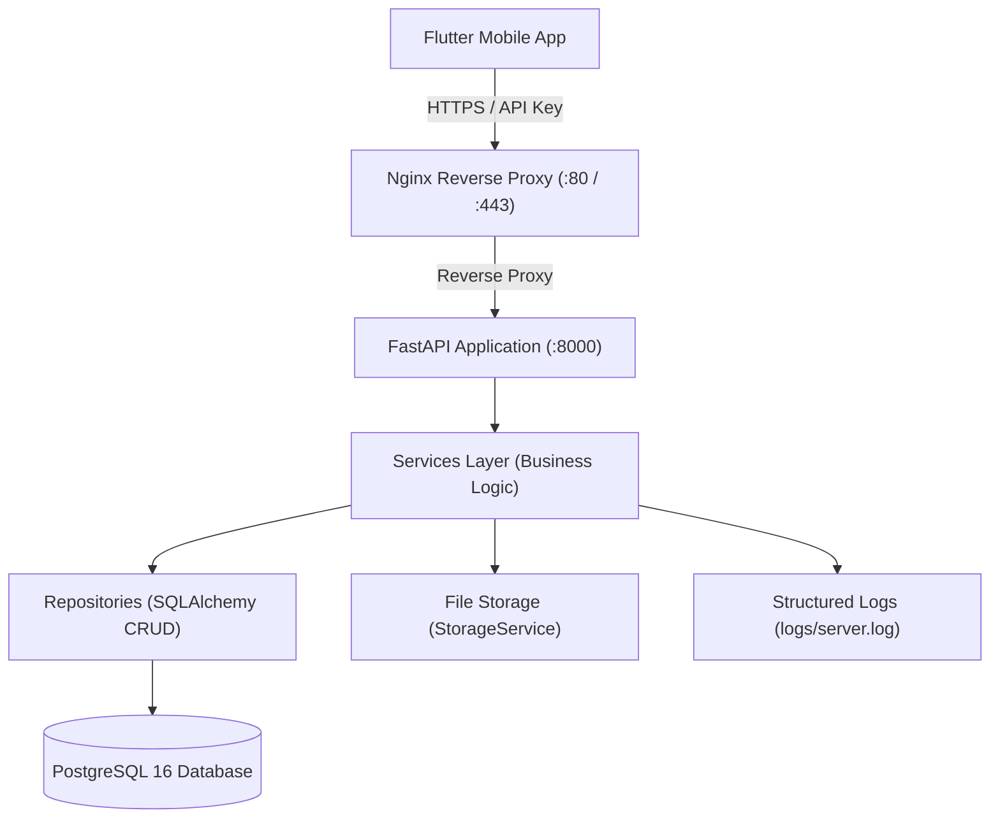

# CloudSync Backup Server

CloudSync Backup is a production-ready, low data-usage remote cloud backup server designed as the backend companion for mobile applications (built in Flutter/FlutterFlow). It is highly optimized for mobile connections, incorporating batch manifest checks for delta synchronization and SHA-256 deduplication to prevent redundant uploads and minimize data usage.

---

## Architecture

The backend implements a standard layered architecture (`API Routes` &rarr; `Services` &rarr; `Repositories` &rarr; `Database`) behind an Nginx reverse proxy.



### Flow Breakdown
1. **API Key Authentication**: Requests are authenticated via `X-API-Key` headers.
2. **Delta Sync Protocol**: The client submits a manifest containing file hashes. The server identifies which hashes are missing and replies, preventing unnecessary uploads.
3. **Streaming Uploads**: Files are streamed directly to disk in 1 MB chunks to prevent loading files entirely into server memory.
4. **UUID Filename Masking**: Uploaded files are assigned unique UUIDs to prevent directory traversal attacks.

---

## Folder Structure

```text
backend/
├── app/
│   ├── api/             # API Router definitions (endpoints)
│   ├── core/            # Configuration, logging setup, security rules
│   ├── database/        # Database session and lifecycle setup
│   ├── middleware/      # Request decompression & custom security headers
│   ├── models/          # SQLAlchemy DB models (Device, Session, MediaFile...)
│   ├── repositories/    # Database CRUD operations isolated from business logic
│   ├── schemas/         # Pydantic v2 schemas for request/response serialization
│   ├── services/        # Service layer (core business logic)
│   ├── static/          # Static files for the dashboard (CSS, styling)
│   └── templates/       # Jinja2 dashboard templates
├── migrations/          # Alembic database migration scripts
├── tests/               # Pytest testing suite
├── Dockerfile           # FastAPI container definition
├── docker-compose.yml   # Multi-container orchestra (FastAPI, Nginx, PostgreSQL)
├── requirements.txt     # Python pinned dependencies
├── pyproject.toml       # Pytest configuration
├── alembic.ini          # Alembic configuration
├── .env.example         # Example env configuration
└── README.md            # Project documentation
```

---

## Technologies

- **FastAPI**: Main web framework (Python 3.12).
- **SQLAlchemy 2.x**: Object Relational Mapper (ORM) using asynchronous execution.
- **Alembic**: Database migrations management.
- **PostgreSQL**: Production-grade relational database.
- **Nginx**: Front-facing proxy handling rate-limiting and connection timeouts.
- **Jinja2 & Bootstrap 5**: Lightweight admin dashboard for storage and telemetry monitoring.
- **Pytest**: Integration and unit testing with aiosqlite (in-memory SQLite).

---

## Quick Start

### 1. Docker Deployment (Recommended)

1. Clone the project and navigate to the backend directory:
   ```bash
   cd cloudsync-backup/backend
   ```
2. Copy the example configuration:
   ```bash
   cp .env.example .env
   ```
   *Note: Edit `.env` to update `API_KEY` and `SECRET_KEY`.*
3. Launch the container stack:
   ```bash
   docker compose up --build -d
   ```
The server will boot, run Alembic migrations, and expose Nginx on port `80`.

### 2. Local Development

1. Set up a Python 3.12 virtual environment:
   ```bash
   python -m venv venv
   source venv/bin/activate  # Windows: .\venv\Scripts\activate
   ```
2. Install dependencies:
   ```bash
   pip install -r requirements.txt
   ```
3. Copy and edit `.env` (adjust `DATABASE_URL` to point to a local postgres instance or SQLite `sqlite+aiosqlite:///local.db`):
   ```bash
   cp .env.example .env
   ```
4. Run migrations:
   ```bash
   alembic upgrade head
   ```
5. Launch FastAPI using Uvicorn:
   ```bash
   uvicorn main:app --reload --port 8000
   ```

---

## Database Migrations

Use Alembic to create and run database migrations:

```bash
# Apply all pending migrations to database
alembic upgrade head

# Rollback the last migration
alembic downgrade -1

# Create a new migration based on model changes
alembic revision --autogenerate -m "describe changes"
```

---

## Environment Variables

| Variable | Description | Default |
|---|---|---|
| `APP_NAME` | Name displayed on the dashboard | `CloudSync Backup` |
| `API_KEY` | Key required in `X-API-Key` headers | `unhackable-demo-key-change-me` |
| `DATABASE_URL` | SQLAlchemy connection string | `postgresql+asyncpg://...` |
| `UPLOAD_DIR` | Directory where uploads are stored | `storage` |
| `MAX_UPLOAD_SIZE_MB` | Maximum allowed file size | `500` |
| `LOG_LEVEL` | Logging verbosity (DEBUG, INFO, etc.) | `INFO` |
| `SECRET_KEY` | Secret key for hashing/sessions | `change-me-to-a-random...` |
| `ALLOWED_ORIGINS` | Allowed origins for CORS | `http://localhost` |
| `CHUNK_READ_SIZE` | Chunk size for streaming file read (bytes) | `1048576` (1 MB) |
| `RATE_LIMIT` | Request rate limits per client | `100/minute` |

---

## GCP Compute Engine VM Deployment + FlutterFlow Integration

This section gives the exact steps to run the backend on a Google Cloud Platform Compute Engine VM and connect it from a FlutterFlow app.

### 1. Create the VM on GCP

1. Open the Google Cloud Console and create a Compute Engine VM.
2. Recommended settings:
   - Image: Ubuntu 22.04 LTS
   - Machine type: e2-medium or better
   - Boot disk: 20 GB SSD minimum
   - Firewall: allow TCP 22, 80, 443
3. Reserve or attach a static external IP for the VM.
4. SSH into the VM.

### 2. Install Docker and Git on the VM

Run the following commands on the VM:

```bash
sudo apt update
sudo apt install -y ca-certificates curl gnupg git ufw
sudo install -m 0755 -d /etc/apt/keyrings
curl -fsSL https://download.docker.com/linux/ubuntu/gpg | sudo gpg --dearmor -o /etc/apt/keyrings/docker.gpg
sudo chmod a+r /etc/apt/keyrings/docker.gpg

echo \
  "deb [arch="$(dpkg --print-architecture)" signed-by=/etc/apt/keyrings/docker.gpg] https://download.docker.com/linux/ubuntu \
  "$(. /etc/os-release && echo "$VERSION_CODENAME")" stable" | \
  sudo tee /etc/apt/sources.list.d/docker.list > /dev/null

sudo apt update
sudo apt install -y docker-ce docker-ce-cli containerd.io docker-buildx-plugin docker-compose-plugin
sudo systemctl enable docker
sudo usermod -aG docker $USER
```

Log out and log back in, or run:

```bash
newgrp docker
```

### 3. Open the required firewall ports

In GCP Console:
- Create or edit a firewall rule to allow:
  - TCP 22 for SSH
  - TCP 80 for HTTP
  - TCP 443 for HTTPS

If you want to keep the database private, do not expose port 5432 publicly.

### 4. Clone the project and prepare the environment

```bash
cd /opt
sudo git clone <your-repo-url> project-nibbles
cd project-nibbles/backend
cp .env.example .env
```

Edit the `.env` file and set the values clearly:

```env
APP_NAME=CloudSync Backup
API_KEY=replace-with-a-long-random-string
DATABASE_URL=postgresql+asyncpg://cloudsync:cloudsync_secret@db:5432/cloudsync_db
UPLOAD_DIR=storage
MAX_UPLOAD_SIZE_MB=500
LOG_LEVEL=INFO
SECRET_KEY=replace-with-a-random-secret-key
ALLOWED_ORIGINS=http://localhost,http://localhost:3000,https://your-domain.com
CHUNK_READ_SIZE=1048576
RATE_LIMIT=100/minute
BUILD_VERSION=1.0.0
```

Important notes:
- `API_KEY` must be the same value that your FlutterFlow app sends in the `X-API-Key` header.
- `ALLOWED_ORIGINS` should include any web frontend origins that will call the backend directly.
- For mobile app usage, CORS is less important, but you should still set it correctly for web preview or web builds.

### 5. Start the backend on the VM

Run:

```bash
docker compose up --build -d
```

This starts:
- PostgreSQL database
- FastAPI backend
- Nginx reverse proxy

### 6. Verify the server is running

Check the service status:

```bash
docker compose ps
```

Verify the health endpoint:

```bash
curl http://localhost/health
```

Expected response:

```json
{"status":"ok"}
```

### 7. Optional: attach a domain and SSL

If you want a production URL instead of the VM IP:

1. Point a DNS A record to the VM external IP.
2. Install a certificate with Certbot or use Cloud SSL Proxy.
3. Update the Nginx config if you want HTTPS redirect.

The current repository already includes an Nginx container and an HTTPS block example in [nginx/nginx.conf](nginx/nginx.conf).

### 8. Backend API endpoints your FlutterFlow app must call

These routes are already implemented and are the ones you need for a backup flow:

| Method | Endpoint | Purpose |
|---|---|---|
| POST | /backup/start | Create a backup session |
| POST | /backup/manifest | Send file hashes and get missing files |
| POST | /upload | Upload the actual file |
| POST | /upload/complete | Verify upload integrity |
| POST | /upload/failure | Report a failed upload |
| GET | /upload/status/{device_id} | Get upload progress |
| GET | /media | List stored media |
| GET | /media/{media_id} | Get media metadata |
| GET | /download/{media_id} | Download a media file |
| GET | /device/sync | Get device sync status |

### 9. Exact request payloads for FlutterFlow

#### A. Start a session

Request:
- Method: POST
- URL: https://your-domain.com/backup/start
- Header: `X-API-Key: <your-api-key>`
- Body:

```json
{
  "device_id": "device-001",
  "device_name": "Phone",
  "platform": "android",
  "total_files": 10,
  "total_bytes": 25000000
}
```

#### B. Send the manifest

Request:
- Method: POST
- URL: https://your-domain.com/backup/manifest
- Header: `X-API-Key: <your-api-key>`
- Body:

```json
{
  "device_id": "device-001",
  "session_id": "<session-id-from-step-a>",
  "files": [
    {
      "sha256": "<64-char-sha256>",
      "size": 1500000,
      "filename": "photo.jpg",
      "mime_type": "image/jpeg"
    }
  ]
}
```

#### C. Upload the missing file

Request:
- Method: POST
- URL: https://your-domain.com/upload
- Header: `X-API-Key: <your-api-key>`
- Body type: `multipart/form-data`
- Fields:
  - `file`: selected file from the phone
  - `device_id`: device id
  - `sha256`: 64-character SHA-256 hash
  - `mime_type`: MIME type of the file
  - `original_filename`: original file name
  - `session_id`: session id from step A
  - `created_time`: optional timestamp

#### D. Mark upload complete

Request:
- Method: POST
- URL: https://your-domain.com/upload/complete
- Header: `X-API-Key: <your-api-key>`
- Body:

```json
{
  "upload_id": "<upload-id-from-step-c>",
  "sha256": "<same-sha256-used-for-upload>"
}
```

#### E. Check upload status

Request:
- Method: GET
- URL: https://your-domain.com/upload/status/device-001
- Header: `X-API-Key: <your-api-key>`

### 10. FlutterFlow app-side setup

In FlutterFlow:

1. Create a custom API group called `CloudSync`.
2. Add an environment variable such as:
   - `backendBaseUrl = https://your-domain.com`
3. For each endpoint, create an API call with the correct method and path.
4. Add the header:
   - `X-API-Key: <your-api-key>`
5. For file uploads, use a multipart form-data request and pass the file from the File Picker or image/video picker.
6. Before calling `/backup/manifest` and `/upload`, compute the SHA-256 of the file locally in the app and send it in the request.
7. Store the returned `session_id` and `upload_id` in app state so the next request can reuse them.
8. Use the `/upload/status/{device_id}` endpoint to show progress in the app.

### 11. Recommended FlutterFlow flow

1. User picks media from the phone.
2. App computes SHA-256 and file metadata.
3. App calls `/backup/start`.
4. App calls `/backup/manifest`.
5. For each missing file, app calls `/upload`.
6. App calls `/upload/complete` for each successful upload.
7. App displays the final status from `/upload/status/{device_id}`.

### 12. Quick local test before deploying to production

From your local machine, test the stack with:

```bash
curl -X POST http://localhost/backup/start \
  -H "X-API-Key: your-api-key" \
  -H "Content-Type: application/json" \
  -d '{"device_id":"device-001","device_name":"Phone","platform":"android","total_files":1,"total_bytes":1000}'
```

If that succeeds, the backend is ready for your FlutterFlow app.

---

## API Reference & Walkthrough

Here is a step-by-step example of a mobile backup synchronization cycle.

### Step 1: Start a Backup Session
The client registers its intention to run a sync, detailing the platform, name, and total target items/bytes.

```bash
curl -X POST http://localhost/backup/start \
  -H "X-API-Key: unhackable-demo-key-change-me" \
  -H "Content-Type: application/json" \
  -d '{
    "device_id": "pixel_7_pro",
    "device_name": "Pixel 7 Pro",
    "platform": "android",
    "total_files": 3,
    "total_bytes": 3500000
  }'
```
**Response:**
```json
{
  "session_id": "97e68220-410a-48d8-9db8-508544e3e3b3",
  "device_id": "pixel_7_pro",
  "status": "active",
  "started_at": "2026-06-30T15:00:00.000Z"
}
```

### Step 2: Query the Manifest (Delta Sync)
Before uploading, the client hashes its local photos/videos and posts their details. The server responds with only the hashes not currently stored in the system.

```bash
curl -X POST http://localhost/backup/manifest \
  -H "X-API-Key: unhackable-demo-key-change-me" \
  -H "Content-Type: application/json" \
  -d '{
    "device_id": "pixel_7_pro",
    "session_id": "97e68220-410a-48d8-9db8-508544e3e3b3",
    "files": [
      {"sha256": "4a28f8df4...d877e68", "size": 1500000, "filename": "IMG_01.png", "mime_type": "image/png"},
      {"sha256": "f626c8cb2...890250b", "size": 2000000, "filename": "IMG_02.png", "mime_type": "image/png"}
    ]
  }'
```
**Response:**
```json
{
  "total_received": 2,
  "already_exists": 1,
  "missing": [
    "f626c8cb2...890250b"
  ],
  "bytes_saved": 1500000
}
```
*Note: In the example response above, the server already had the first file. The client now skips uploading `IMG_01.png` and only streams `IMG_02.png`, saving 1.5 MB of data.*

### Step 3: Stream Upload the Missing Files
The client uploads the missing file.

```bash
curl -X POST http://localhost/upload \
  -H "X-API-Key: unhackable-demo-key-change-me" \
  -F "file=@/path/to/IMG_02.png;type=image/png" \
  -F "device_id=pixel_7_pro" \
  -F "sha256=f626c8cb2...890250b" \
  -F "mime_type=image/png" \
  -F "original_filename=IMG_02.png" \
  -F "session_id=97e68220-410a-48d8-9db8-508544e3e3b3"
```
**Response:**
```json
{
  "success": true,
  "upload_id": "3be5cf22-901d-4008-8e6d-2dcf1e73998b",
  "stored_filename": "cb03164ad0e74f828a2a89feeb61d0bf.png",
  "sha256": "f626c8cb2...890250b",
  "size": 2000000,
  "is_duplicate": false,
  "created_at": "2026-06-30T15:02:15.000Z"
}
```

### Step 4: Verify Upload Completion
The client triggers a final hash check to guarantee the server successfully stored the file with zero corruption.

```bash
curl -X POST http://localhost/upload/complete \
  -H "X-API-Key: unhackable-demo-key-change-me" \
  -H "Content-Type: application/json" \
  -d '{
    "upload_id": "3be5cf22-901d-4008-8e6d-2dcf1e73998b",
    "sha256": "f626c8cb2...890250b"
  }'
```
**Response:**
```json
{
  "success": true,
  "upload_id": "3be5cf22-901d-4008-8e6d-2dcf1e73998b",
  "verified": true,
  "message": "Verification successful"
}
```

### Other Endpoints

#### Query Sync Status
Checks a device's synchronization records and sizes:
```bash
curl -H "X-API-Key: unhackable-demo-key-change-me" http://localhost/device/sync?device_id=pixel_7_pro
```

#### Download File with Range Headers (Resumable Download)
Restore a file, enabling resuming if connection drops:
```bash
curl -H "X-API-Key: unhackable-demo-key-change-me" -H "Range: bytes=0-1048575" http://localhost/download/3be5cf22-901d-4008-8e6d-2dcf1e73998b --output part1.bin
```

---

## FlutterFlow / Flutter Integration

To integrate with your mobile app:

1. **API Key Setup**: Add header `"X-API-Key": "<your-key>"` to all API calls.
2. **Sync Loop**:
   - Query client storage database for all files to be backed up.
   - Group them and compute SHA-256 for each.
   - Start session via `POST /backup/start`.
   - Submit hashes to `POST /backup/manifest`.
   - Iterate through files whose hashes are returned in `missing`:
     - Send files via `POST /upload`. Ensure you stream the bytes (e.g., using `http.MultipartRequest` in Dart).
     - Once uploaded, send verification check to `POST /upload/complete`.
     - Update progress bar locally.

---

## Deployment Guide

### VPS (DigitalOcean / Hetzner) Setup

1. Spin up a VPS (Ubuntu 22.04 LTS, min 2GB RAM).
2. Install Docker and Docker Compose:
   ```bash
   sudo apt update
   sudo apt install -y docker.io docker-compose-v2
   sudo systemctl enable --now docker
   ```
3. Copy backend files onto the server.
4. Set up Let's Encrypt for SSL:
   ```bash
   sudo apt install -y certbot python3-certbot-nginx
   sudo certbot certonly --webroot -w /var/www/certbot -d yourdomain.com
   ```
5. Edit `/etc/nginx/nginx.conf` matching the uncommented HTTPS block in `nginx/nginx.conf`, restart container stack, and traffic is fully encrypted under TLS.

---

## Phase 2 Roadmap

For production environments scale, the following extensions can be integrated:
1. **Background Job Processors**: Move long-running tasks like checksum validations and cleanup tasks onto Celery with Redis.
2. **Chunked / Resumable Uploads**: Implement the `tus-protocol` to allow pausing and resuming chunk transfers.
3. **E2E Encryption**: Encrypt images on the mobile client (using AES-256-GCM) prior to transmitting.
4. **Thumbnail Auto-generation**: Add backend thumbnail generation (using Pillow/FFmpeg) if mobile thumbnails are missing.
5. **Virus Scanning**: Implement scanning pipelines using ClamAV inside the file upload flow.
6. **Kubernetes Migration**: Migrate the Docker Compose architecture into Helm charts for cluster orchestration.
